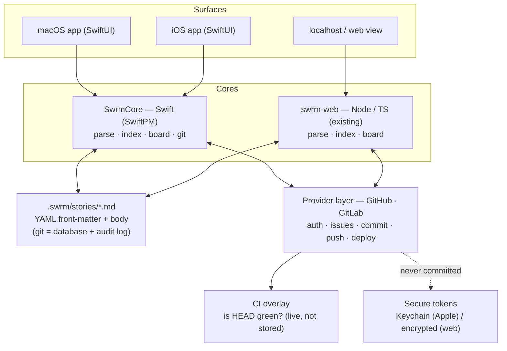

# Swrm — architecture (living doc)

> Refreshed as the system is built. The rendered snapshot lives at
> `assets/architecture.svg`; this Mermaid source is canonical.

**Core decision:** the **git repo of Markdown stories is the only shared
contract.** Every surface is a renderer over the same `front-matter + body`
schema. No cross-language core bridge — native is Swift, web is the existing
Node app, unified only by the file format and git.



## Story schema (the contract)
```
.swrm/stories/sc-42.md
---
id: sc-42
type: feature        # feature | bug | chore
state: started       # backlog | unstarted | started | done   (the 4 Shortcut state types)
epic: onboarding
labels: [ios, p1]
rank: "0|hzzzzz:"    # lexorank — column ordering
---
Wire up the login screen.
- [ ] form
- [ ] validation
```
- Board column = the `state` type. Moving a card = one front-matter field edit = one clean git commit.
- CI status is an **overlay** fetched live per HEAD — never written into Markdown.
- Branch convention `sc-<id>/slug`; PR merge → `state: done` (suppressed if other open PRs).
