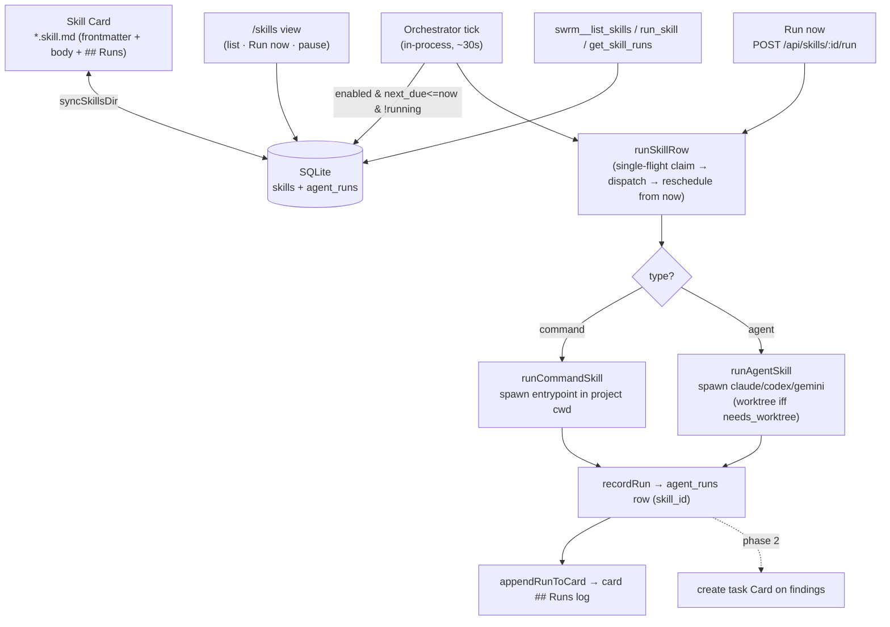

# Skill Mode — architecture

_Last updated: 2026-05-27_

Skill Mode adds recurring, scheduled automations ("Skill Cards") on top of swrm's
existing background-agent system. A Skill Card is a `*.skill.md` file (YAML
frontmatter + body) synced into SQLite. An in-process orchestrator runs due
cards — as an AI **agent** or a shell **command** — records each run, and writes
a dated summary back to the card.

Spec: [`tasks/prd-swarm-skills.md`](../tasks/prd-swarm-skills.md).

## Pieces

| Concern | Module |
|---|---|
| Domain types + vocab | `src/skills/types.ts` |
| Card schema | `src/migrations/009_skills.sql` |
| Run-history link (reuses `agent_runs`) | `src/migrations/010_agent_runs_skill_link.sql` |
| Markdown ↔ SQLite sync | `src/skills/sync.ts` |
| Frequency → `next_due` (local time) | `src/skills/schedule.ts` |
| Command executor | `src/skills/executor.ts` |
| Agent executor | `src/skills/agent.ts` |
| Run recording + card log | `src/skills/runlog.ts` |
| Orchestrator (tick, single-flight, catch-up) | `src/skills/orchestrator.ts` |
| API (list / run-now / pause) | `src/api/skills.ts` |
| `/skills` view | `src/views/skills.ts` |
| MCP tools | `src/mcp/tools.ts` |

## Key invariants

- **Markdown is the source of truth.** The `skills` table is a derived mirror; pause/resume rewrites the card's `enabled:` line.
- **Run history reuses `agent_runs`** — a skill run is an `agent_runs` row with `skill_id` set, not a parallel table.
- **No worktree by default.** Agent skills run in the project cwd unless `needs_worktree: true`.
- **`next_due` is authoritative + persisted.** The tick interval is only resolution; a far-past `next_due` collapses into one catch-up run.
- **`external` side-effects are draft-only** in v1 (no auto-send) — convention enforced by executor behavior.
