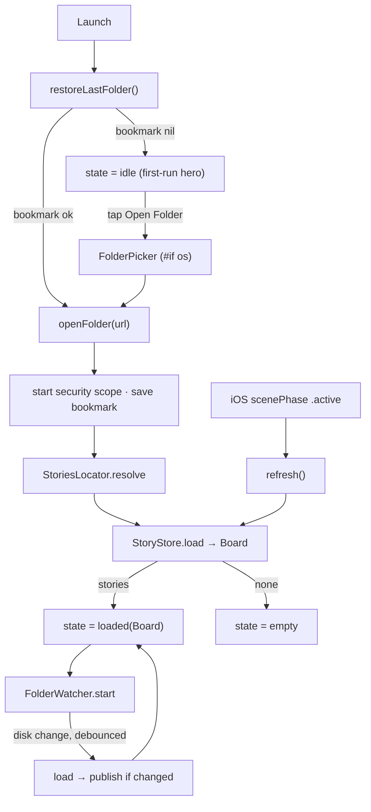

# Native real local board — design (Slice A)

_Date: 2026-05-28 · Status: approved design, pre-plan_

## Context

The native track (`native/`, commit `f7c813f`) is a **read-only, sample-data board renderer**:
`SwrmCore` parses `.swrm/stories/*.md` → `Story`/`Board` (no write-back), `SwrmUI.BoardView`
renders, and `Apps/Shared/ContentView` shows `SampleData.board` — hardcoded. The vision
(`docs/architecture.md`) goes much further (write-back, git commit-on-move, GitHub/GitLab
providers, CI overlay, Keychain). That whole effort decomposes into four slices:

| Slice | Scope |
|---|---|
| **A — real local board** *(this spec)* | Pick a folder, load real `.swrm/stories/*.md`, render read-only on macOS + iOS, live-refresh on disk change. |
| B — local edit loop | Write-back + drag-to-move (`state` change → rewrite `.md`). |
| C — git-backed moves | One front-matter edit = one clean commit; branch convention. |
| D — providers + CI + auth | GitHub/GitLab, push, PR→done, live CI overlay, Keychain tokens. |

This spec covers **Slice A only**. B–D are referenced as the backbone (see Event Modeling
blueprint) but not designed here.

### Known divergence (informs, does not block)

The existing **Node localhost app** renders from **SQLite + `tasks/todo.md`/`backlog.md`**, not
`.swrm/stories/*.md`. The per-story format is the *native* contract; today only the bundled
`native/sample/stories/` emits it. Slice A reads a folder of per-story `.md` files; **producing
`.swrm/stories/` from real projects, and teaching the web surface to read it, is the web
fast-follow (Slice A-web), not this slice.**

## Goal

A person opens the native app (macOS or iOS), picks a folder, and sees their swrm board —
rendered from real `.swrm/stories/*.md` files — that stays current as those files change on
disk. Read-only: no editing, no drag, no git. Smallest verifiable increment that replaces
`SampleData` and unblocks native dogfooding.

## Decisions locked (from brainstorming)

1. **Platforms:** both macOS + iOS in Slice A (parsing + `BoardView` already shared in
   `Apps/Shared`; only the folder *picker* differs per platform).
2. **Folder logic:** smart locate — look for `<picked>/.swrm/stories/`; if absent, treat the
   picked folder itself as the stories dir. Handles project roots, the sample, and arbitrary
   front-matter `.md` folders.
3. **Freshness:** live file-watching (`DispatchSource` on the dir fd) + a manual/foreground
   refresh backstop (iOS sandboxed-folder watching is less reliable).
4. **Architecture:** three-layer split (Approach A) — watcher + bookmarks + locator in
   `SwrmCore` (pure Foundation, unit-testable); `@Published` view model in `SwrmUI`; only the
   `#if os` picker in `Apps`.
5. **Web:** native now; web is a fast-follow (extend the Node app), bound to the same contract.
6. **Event Modeling:** used as the modeling *lens* for the whole redesign (blueprint below).
   Slice A code stays a plain projection — **no event store**.
7. **Card content:** unchanged from the built `StoryCardView` — id · type badge · title · labels.
   No checklist count / epic tag / vertical-iOS changes.

## Architecture (Approach A)

Module graph stays `SwrmCore ← SwrmUI ← Apps/Shared`. New code by layer:

### SwrmCore (pure Foundation, no UI — tested in `SwrmCoreTests`)

- **`StoriesLocator.swift`** — `resolve(pickedFolder: URL) -> URL`. If
  `<picked>/.swrm/stories/` is an existing directory → return it, else return `<picked>`.
  Pure, no I/O beyond an `isDirectory` check.
- **`BookmarkStore.swift`** — persist/resolve a security-scoped bookmark for the last folder.
  - `save(_ url: URL)` — `url.bookmarkData(options:)` → UserDefaults (key `swrm.lastFolderBookmark`).
    `#if os(macOS)` uses `.withSecurityScope`; iOS uses minimal options (no such flag).
  - `resolve() -> URL?` — read data, `URL(resolvingBookmarkData:bookmarkDataIsStale:)`;
    on stale or error, clear the key and return `nil`.
  - `clear()`.
- **`FolderWatcher.swift`** — watch a directory for changes.
  - `init(url:onChange:)`, `start()`, `stop()`. Opens the dir fd, creates a
    `DispatchSource.makeFileSystemObjectSource(eventMask: [.write, .delete, .rename, .extend])`
    on a serial queue, debounces bursts (~200 ms), invokes `onChange` on the main queue.
  - `stop()` cancels the source and closes the fd; idempotent. `deinit` calls `stop()`.
- **`StoryStore.swift`** — unchanged (`init(directory:)`, `load()`, `board()`). The view model
  resolves the dir via `StoriesLocator` first, then constructs `StoryStore` on the result.

### SwrmUI (SwiftUI + SwrmCore)

- **`BoardModel.swift`** — `final class BoardModel: ObservableObject` (Combine — see deployment
  note). Published: `@Published private(set) var state: LoadState`,
  `@Published private(set) var folderName: String?`.
  - `enum LoadState: Equatable { case idle, loading, loaded(Board), empty, error(String) }`.
  - `func openFolder(_ url: URL)` — stop prior watcher + `stopAccessingSecurityScopedResource`;
    `startAccessingSecurityScopedResource()` (→ `error` if false); `BookmarkStore.save`;
    `StoriesLocator.resolve`; set `loading`; `load()`; publish `loaded`/`empty`; start watcher.
  - `func restoreLastFolder()` — `BookmarkStore.resolve()`; nil → `idle`; else run the open flow
    on the resolved URL (no re-save).
  - `func refresh()` — re-run `load()` for the current folder (manual button + iOS foreground).
  - Watcher `onChange` → debounce → `load()` → publish **only if the new `Board` differs**
    (`Board: Equatable`), avoiding redundant renders.
  - Lifecycle: holds the security scope while a folder is open; releases on `openFolder`
    switch and `deinit`.

### Apps/Shared (AppKit/UIKit, conditional)

- **`FolderPicker.swift`** — `#if os(macOS)` `NSOpenPanel` (`canChooseDirectories = true`,
  `canChooseFiles = false`); `#else` `UIDocumentPickerViewController(forOpeningContentTypes:
  [.folder])` wrapped in a `UIViewControllerRepresentable`. Returns the picked `URL` to the model.
- **`ContentView.swift`** — replace `BoardView(board: SampleData.board)` with
  `@StateObject var model = BoardModel()`:
  - `.onAppear { model.restoreLastFolder() }`.
  - Toolbar: "Open Folder…" (presents picker → `model.openFolder`), "⟳ Refresh".
  - Body switches on `model.state`: `idle` → first-run hero, `loading` → spinner,
    `loaded(board)` → `BoardView(board:)`, `empty` → "No stories found", `error(msg)` → message + re-open.
  - `.onChange(of: scenePhase)` → `.active` → `model.refresh()` (iOS watch backstop).
  - Keep `SampleData` for SwiftUI previews.
- **Entitlements** (`project.yml`): macOS sandbox →
  `com.apple.security.files.user-selected.read-only` + `com.apple.security.files.bookmarks.app-scope`.
  iOS picker needs none.

### Data flow

## Shared contract & visual tokens (web-parity lever)

All surfaces render the **same contract**; parity is guaranteed by sharing it, not by sharing code.

**Story schema** (front-matter + body) and **board derivation** are already canonical in
`docs/architecture.md` and `Board.swift`: group stories by `state` into four columns; within a
column sort by `rank` (lexorank string compare; `nil` first).

**Visual tokens** (extracted from `SwrmUI/Theme.swift` — the web fast-follow reuses these exact values):

| Token | Hex | Use |
|---|---|---|
| charcoal | `#15130F` | board background |
| surface | `#1F1B14` | column background |
| honey | `#F5A623` | type badge, In-Progress accent |
| honeyLight | `#FFC24B` | badge text |
| cream | `#F3E9D2` | primary text |
| muted | `#B9AE94` | secondary text, Backlog accent |

| Column (`state`) | Title | Accent |
|---|---|---|
| backlog | Backlog | muted `#B9AE94` |
| unstarted | To Do | `#93C5FD` |
| started | In Progress | honey `#F5A623` |
| done | Done | `#4ADE80` |

## Event Modeling blueprint (lens)

Slice A's swimlane drives the code's method + state names 1:1. Slices B–D are the backbone this
extends — included so the model is coherent end-to-end. **Events in Slice A are transient labels,
not persisted facts; from Slice C on, events are git commits (the append-only audit log).**

### Slice A (this spec)

| Slice | UI | Command | Event | Read model |
|---|---|---|---|---|
| Open folder | First-run hero → "Open Folder…" | `OpenFolder(url)` | `FolderOpened` (+bookmark saved) | `SelectedFolder` |
| Load stories | Board renders | `LoadStories` | `StoriesLoaded` (transient/IO) | `Board` |
| Files change on disk | Board live-updates | `ReloadStories` (auto, watcher) | `StoriesChangedOnDisk` ⟵ editor/Node/git | `Board′` |
| Refresh | ⟳ button / iOS foreground | `RefreshBoard` | `StoriesLoaded` | `Board` |

### Backbone appendix (B–D, not designed here)

| Slice | Command | Event | Read model |
|---|---|---|---|
| B · move card | `MoveStory(id,state)` | `StoryStateChanged` → rewrite `.md` | `Board` |
| B · edit field | `EditStory(id,…)` | `StoryEdited` | `Board` |
| C · commit | `CommitChange` | `ChangeCommitted(sha)` ⟵ **git = event store** | `Board` + History |
| C · start work | `CreateBranch` | `BranchCreated` (`sc-id/slug`) | Branch state |
| D · push/PR | `OpenPullRequest` | `PROpened` | PR status |
| D · CI | — | `CIStatusChanged` ⟵ provider | CI overlay (live, never stored) |
| D · merge | — | `PRMerged` ⟵ provider | Story → done |

## Error handling (resilient — never blank the board)

| Condition | Behavior |
|---|---|
| Stale/unresolvable bookmark | `BookmarkStore` clears it → `state = idle` (re-prompt). |
| `startAccessingSecurityScopedResource` returns false | `state = error("Couldn't access folder. Re-open.")`. |
| Folder readable, zero valid stories | `state = empty` ("No stories found"). |
| One malformed `.md` | Skipped (`StoryStore` already `try?`); the rest render. |
| Watcher fd open fails | Fall back to manual/foreground refresh only; log, no crash. |

## Testing

- **`SwrmCoreTests`** (extend existing):
  - `StoriesLocator` — `.swrm/stories/` present vs absent (temp dirs).
  - `BookmarkStore` — save → resolve round-trip in a temp dir; stale handling returns `nil`.
  - `FolderWatcher` — start on a temp dir, write a file, assert `onChange` fires within a timeout.
  - `StoryStore` — load a fixture dir (covers skip-on-malformed); board derivation already tested.
- **`BoardModel`** — drive `openFolder`/`restoreLastFolder`/`refresh` over temp folders, assert
  `@Published state` transitions: loaded / empty / error.
- **UI** — SwiftUI previews per `LoadState` via `SampleData` (manual, not automated).

## Deployment-target note

`project.yml` targets macOS 13 / iOS 16. The `@Observable` macro needs macOS 14 / iOS 17, so
`BoardModel` uses `ObservableObject` + `@Published` (Combine, available on the current floor).
Cheaper than raising the deployment floor for Slice A.

## Out of scope (Slice A)

- Any editing, drag-to-move, or write-back (Slice B).
- Git anything (Slices C/D).
- Providers, auth, CI, Keychain (Slice D).
- The web renderer (Slice A-web fast-follow — extend the Node app on the shared tokens).
- Producing `.swrm/stories/` from real projects / from the Node SQLite model.
- Multiple open folders / recents; checklist-count / epic tags on cards.
