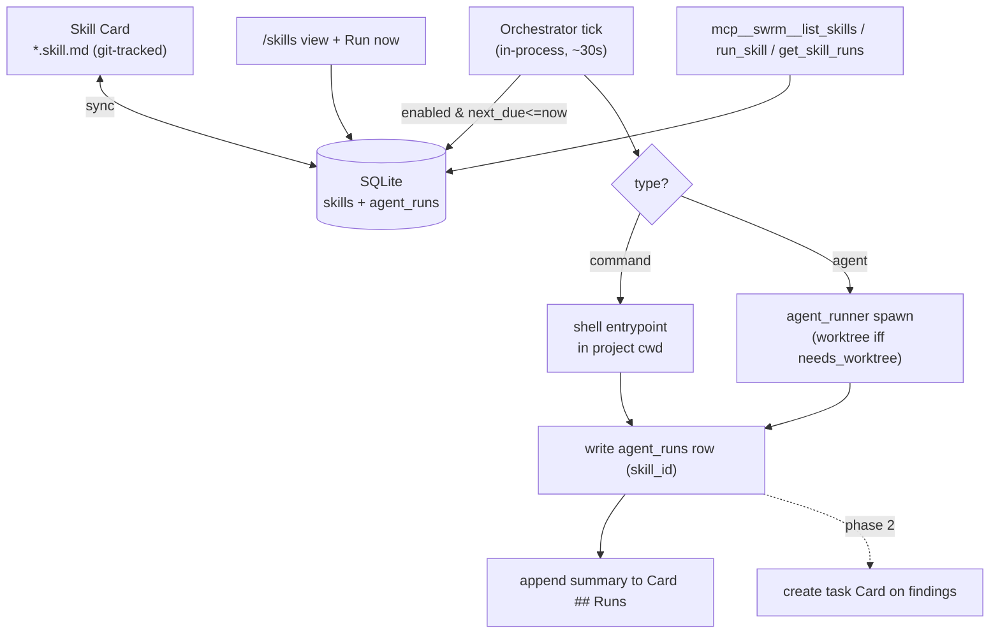

# PRD: Swarm Skills (Skill Mode)

_Created: 2026-05-27 · Status: draft for review_

## 1. Introduction / Overview

Today swrm runs one mode: **Card Mode** — a human (or Claude) picks a Kanban task, spawns an agent attempt in a git worktree, reviews the diff, merges. Everything is event-driven and manual-start.

This feature adds a second mode: **Skill Mode** — recurring, scheduled automations defined as Markdown **Skill Cards**. An in-process orchestrator wakes on a timer, finds Skill Cards that are due, runs each one (as either an AI agent or a shell command), writes the results back into the card, and records a run in history. The first real user is the `nugget-expo` project's daily Contact + Company listeners, which today must be triggered by hand.

A Skill Card is plain Markdown with YAML frontmatter, git-tracked and synced to SQLite via swrm's existing `sync_md` reconciler. Pausing or retuning a skill is a one-line frontmatter edit — human oversight stays as simple as opening a file.

**Terminology:** a swrm **Skill Card** is the scheduled-job artifact defined here. It is distinct from a *Claude Code skill* — though a Skill Card of `type: agent` may invoke a Claude Code skill as its action. "Skill Card" always means the swrm artifact in this document.

## 2. Goals

- Run recurring automations on a schedule with **zero new infrastructure** (in-process, reuses existing primitives).
- Skill Cards are **Markdown-first**: git-tracked, human-readable, editable to pause/retune.
- Support two executors: **agent** (spawn Claude/Codex/Gemini) and **command** (shell entrypoint).
- Be **stateful**: every run is recorded; a skill can see its prior outputs and avoid duplicate work.
- Keep a **git + Markdown audit trail**: each run appends a dated summary to its card.
- Enforce a **safety model**: a skill declares its side-effects; external-action skills produce drafts/findings for human review, never auto-send.
- Drive it all from inside Claude Code via **MCP tools**.

## 3. User Stories

Stories are ordered as a KAIZEN build sequence — each is small enough for one focused session and independently verifiable.

### US-001: Skill Card schema + `skills` table
**Description:** As a developer, I need a place to persist Skill Card definitions so the orchestrator can query what's due.

**Acceptance Criteria:**
- [ ] Migration adds `skills` table (columns per §6 schema), default `enabled=1`, `last_status='idle'`.
- [ ] TypeScript types for `Skill` + `SideEffects`/`SkillType` unions exported from a single module.
- [ ] Migration runs cleanly on a fresh DB and on the current v7 DB.
- [ ] Typecheck passes.

### US-002: Link `agent_runs` to skills (reuse, not a new table)
**Description:** As a developer, I need per-run records so skills are stateful and auditable — reusing the existing `agent_runs` table (001_init) rather than a parallel `skill_runs` table.

**Acceptance Criteria:**
- [ ] Migration adds nullable columns to `agent_runs`: `skill_id` (FK → `skills.id`, `ON DELETE SET NULL`), `finished_at`, `findings_count`.
- [ ] Index on `(skill_id, created_at)`.
- [ ] Legacy `agent_runs` inserts (`bug_fix`, `prioritize_backlog`) keep working — new columns nullable.
- [ ] Typecheck passes.

> **Reconciliation note:** swrm already has a background-agent run log (`agent_runs`) plus hardcoded agents in `src/api/agents/`. Skill Mode *generalizes* these into Markdown-configured cards, so a skill run is an `agent_runs` row with `skill_id` set — no second run-history table.

### US-003: Sync Skill Cards (Markdown ↔ SQLite)
**Description:** As a user, I want my `*.skill.md` files to be the source of truth, synced into the DB like other markdown.

**Acceptance Criteria:**
- [ ] Extend `src/sync_md.ts` (or a sibling `sync_skills.ts`) to read the configured skills dir, parse frontmatter, and upsert into `skills`.
- [ ] Body content hash stored; unchanged files are skipped (no needless writes).
- [ ] A removed/`enabled: false` card is reflected in the DB (soft-disable, not hard-delete).
- [ ] Unit test: a fixture card parses to the expected row. Typecheck passes.

### US-004: Frequency parser → `next_due`
**Description:** As a developer, I need to turn a human frequency string into the next due timestamp.

**Acceptance Criteria:**
- [ ] Pure function `nextDue(frequency, lastRun, now): Date`.
- [ ] Supports `@hourly`, `@daily`, `@daily HH:MM`, `Nh`, `Nm`, `weekly:<dow>`.
- [ ] Unknown/invalid frequency → throws a clear error (surfaced as `last_status='error'`, never silent).
- [ ] Unit tests cover each format + a missed-run (lastRun far in past) case. Typecheck passes.

### US-005: Command executor + write-back
**Description:** As a user, I want a `type: command` skill to run its shell entrypoint and record the result.

**Acceptance Criteria:**
- [ ] Runs `command` in the project's `cwd`, captures stdout/stderr, enforces `timeout`.
- [ ] Writes an `agent_runs` row (`skill_id` set, `ok`/`error`) and appends a dated summary to the card's `## Runs` section (newest on top, capped at 20).
- [ ] Non-zero exit → `status='error'`, stderr captured in `error`; no exception escapes the executor.
- [ ] Typecheck passes.

### US-006: Agent executor (no worktree by default)
**Description:** As a user, I want a `type: agent` skill to spawn an agent that reads the card body as its prompt and acts via allowed MCP tools.

**Acceptance Criteria:**
- [ ] Reuses `src/lib/agent_runner.ts`; spawns the configured `agent` (claude/codex/gemini).
- [ ] No git worktree is created unless `needs_worktree: true`.
- [ ] Only MCP servers listed in `mcp:` are passed to the agent.
- [ ] Captures the agent's final summary into the run row + card Runs log.
- [ ] Typecheck passes.

### US-007: In-process orchestrator tick
**Description:** As a user, I want due skills to run automatically while the swrm server is up.

**Acceptance Criteria:**
- [ ] On server boot, a ticker (default every 30s, configurable) selects `enabled=1 AND next_due<=now AND last_status!='running'`.
- [ ] Single-flight: a skill is marked `running` before dispatch; a crash/restart clears stale `running` older than `timeout`.
- [ ] Missed-run catch-up: a far-past `next_due` runs **once**, then `next_due` is recomputed from now (no burst of catch-up runs).
- [ ] After each run, `last_run`, `next_due`, `last_status` are updated in DB and written back to the card frontmatter.
- [ ] Typecheck passes.

### US-008: "Run now" manual trigger
**Description:** As a user, I want to run a skill on demand without waiting for its schedule.

**Acceptance Criteria:**
- [ ] `POST /api/skills/:id/run` enqueues an immediate run (respects single-flight).
- [ ] "Run now" button on the skill row triggers it; UI reflects `running → ok/error`.
- [ ] Typecheck passes.
- [ ] **(UI)** Verify in browser using dev-browser skill.

### US-009: Skills list view (`/skills`)
**Description:** As a user, I want a screen listing all Skill Cards with status and schedule.

**Acceptance Criteria:**
- [ ] `/skills` route renders each card: name, project, type, `side_effects` badge, `enabled` state, `last_status`, `last_run`, `next_due`.
- [ ] Link in the topbar nav (alongside tasks / board).
- [ ] Empty state with guidance when no skills exist.
- [ ] Typecheck passes.
- [ ] **(UI)** Verify in browser using dev-browser skill.

### US-010: Enable / pause toggle (writes back to Markdown)
**Description:** As a user, I want to pause a skill from the UI and have it reflected in the source Markdown.

**Acceptance Criteria:**
- [ ] Toggle on the skill row flips `enabled` in DB **and** rewrites the card's frontmatter `enabled:` line.
- [ ] A paused skill is skipped by the orchestrator tick.
- [ ] Editing `enabled:` in the file (then sync) produces the same result — file and UI agree.
- [ ] Typecheck passes.
- [ ] **(UI)** Verify in browser using dev-browser skill.

### US-011: MCP tools for skills
**Description:** As Claude, I want to list, run, and inspect skills via MCP so I can drive Skill Mode from a conversation.

**Acceptance Criteria:**
- [ ] Adds `mcp__swrm__list_skills`, `mcp__swrm__run_skill`, `mcp__swrm__get_skill_runs`.
- [ ] Registered in the existing stdio JSON-RPC server (`src/mcp/`), covered by the MCP integration test.
- [ ] Typecheck passes.

### US-012: Architecture diagram (diagram-as-code)
**Description:** As a maintainer, I want a current rendered diagram of Skill Mode so the architecture stays visible (per the project's standing "visualize architecture" rule).

**Acceptance Criteria:**
- [ ] `docs/skill-mode-architecture.md` contains a Mermaid diagram matching §6.
- [ ] Diagram renders (GitHub Mermaid or local render) without syntax errors.
- [ ] Linked from this PRD and the README roadmap entry.

## 4. Functional Requirements

- **FR-1:** A Skill Card is a `*.skill.md` file with YAML frontmatter (schema §6) and a free-form Markdown body used as the agent prompt / human description.
- **FR-2:** Skill Cards are synced into the `skills` SQLite table; the Markdown file is the source of truth (DB is a derived mirror).
- **FR-3:** The system must support two executor types: `agent` (spawns an AI agent via `agent_runner`) and `command` (runs a shell entrypoint).
- **FR-4:** `type: agent` skills must NOT create a git worktree unless `needs_worktree: true`.
- **FR-5:** An in-process orchestrator must, on a configurable interval, run every skill where `enabled AND next_due<=now AND last_status!='running'`.
- **FR-6:** The orchestrator must guarantee single-flight per skill and must collapse missed runs into a single catch-up run.
- **FR-7:** Each run must create an `agent_runs` record (with `skill_id` set) and append a dated summary to the card's `## Runs` section (newest first, capped at 20).
- **FR-8:** After each run, `last_run`, `next_due`, and `last_status` must be persisted to both DB and the card frontmatter.
- **FR-9:** A skill must declare `side_effects: read-only | writes | external`. `external` skills must not perform outward actions automatically — outputs are drafts/findings only.
- **FR-10:** Only MCP servers listed in a skill's `mcp:` array may be exposed to its agent run.
- **FR-11:** Users must be able to pause a skill by setting `enabled: false` in the file or via the `/skills` UI toggle; both paths must agree.
- **FR-12:** `POST /api/skills/:id/run` must trigger an immediate run, respecting single-flight.
- **FR-13:** MCP tools `list_skills`, `run_skill`, `get_skill_runs` must be available.
- **FR-14:** Errors (bad frequency, command failure, agent failure, timeout) must set `last_status='error'` with detail captured — never a silent failure.

## 5. Non-Goals (Out of Scope for v1)

- **Auto-creating a task Card from findings** — Phase 2. The schema reserves `on_findings` but v1 only `append`s to the card.
- **Findings de-duplication / content hashing of results** — Phase 2 (needed once auto-task-creation exists).
- **Full cron expression syntax** — v1 ships the small frequency vocabulary in US-004; cron is a later add.
- **Sandboxing / OS-level enforcement of `side_effects`** — v1 enforces by convention + executor behavior; hard sandboxing is later.
- **Distributed / multi-host scheduling, persistence of the ticker across machines** — single localhost process only.
- **Running skills while the server is down** — no external cron/daemon in v1 (4A). Catch-up handles downtime on next boot.
- **A visual Skill Card editor** — edit the Markdown file; the UI is read + run + pause only.

## 6. Design Considerations

### Skill Card frontmatter schema

```yaml
---
name: contact-listener            # unique per project; slug
project: nugget-expo              # swrm project/board this belongs to
type: agent                       # agent | command
enabled: true                     # pause switch
frequency: "@daily 07:00"         # @hourly | @daily[ HH:MM] | Nh | Nm | weekly:<dow>
side_effects: read-only           # read-only | writes | external (orchestrator-enforced)
timeout: 600                      # seconds; run is killed past this

# --- type: agent only ---
agent: claude                     # claude | codex | gemini
needs_worktree: false             # true only if the run edits code
mcp: [Gmail, Firebase]            # MCP servers allowed for this run

# --- type: command only ---
command: "node scripts/contact-scan.js"   # entrypoint, run in project cwd

# --- behavior ---
on_findings: append               # v1: append (phase2: create-task)

# --- written by the orchestrator (do not hand-edit) ---
last_run: 2026-05-27T07:00:12Z
next_due: 2026-05-28T07:00:00Z
last_status: ok                   # idle | running | ok | error | skipped
---

# Contact Listener
<free-form body — used as the agent prompt for type: agent,
 or as human documentation for type: command>

## Runs
### 2026-05-27 07:00 — ok (42s)
- 3 new contacts, 1 did-you-know surfaced; no external actions taken.
```

### Storage location

Skills dir is configurable in `src/lib/config.ts` (`SWRM_SKILLS_DIR`). **Decided:** default is outside-repo — `~/.swrm/<project>/skills/*.skill.md` — to keep the target repo's git tree clean (consistent with running the DB outside the repo). Opt-in to `<repo>/.swrm/skills/` for teams that want skills git-tracked alongside code.

### Architecture (mirrors `docs/skill-mode-architecture.md`)



### Reuse of existing components

- `src/sync_md.ts` — pattern for Markdown↔SQLite reconciliation (US-003).
- `src/lib/agent_runner.ts` — agent spawning (US-006).
- `src/lib/worktree.ts` — only when `needs_worktree: true`.
- `src/lib/prd_md_render.ts` — pattern for rendering DB rows back to Markdown (card write-back).
- `src/lib/config.ts` — add `SWRM_SKILLS_DIR`, `SWRM_TICK_MS`.
- `src/mcp/` — register the three new tools (US-011).
- `src/server.ts` — start the orchestrator ticker on boot.

## 7. Technical Considerations

- **Single-flight & crash recovery:** mark `running` with a started-at; on boot, any `running` older than its `timeout` is reset to `error` (stale lock).
- **Clock / catch-up:** `next_due` is authoritative and persisted; the tick interval only controls *resolution*, not correctness, so a coarse 30s tick is fine.
- **Frontmatter write-back:** must preserve the human-authored body and `## Runs` log; only the managed keys (`last_run`, `next_due`, `last_status`, and `enabled` on toggle) are rewritten.
- **Concurrency budget:** "Swarm can spawn multiple agents for heavy skills" — v1 runs skills sequentially per tick with a small max-parallel cap (config) to avoid a thundering herd; true fan-out is a later concern.
- **Secrets:** agent runs inherit the environment; `mcp:` allowlist bounds reach. No secrets are written to cards or run logs.
- **Failure visibility:** errors surface in `/skills` (`last_status=error`) and in the card Runs log — aligns with the project rule against silent failures.

## 8. Success Metrics

- The `nugget-expo` Contact + Company listeners run daily with **zero manual triggering** for one week.
- Pausing a skill is a single one-line edit (file or toggle) and takes effect by the next tick.
- A failed run is visible in `/skills` and the card within one tick — no silent failures.
- Adding a new Skill Card requires only dropping a `*.skill.md` file in the skills dir (no code change).
- Server restart during a scheduled window results in exactly one catch-up run (not zero, not many).

## 9. Decisions (resolved 2026-05-27)

All five prior open questions are now decided:

- **D-1 — Default skills dir:** outside-repo `~/.swrm/<project>/skills/` (keeps the target repo clean), with opt-in `<repo>/.swrm/skills/` via `SWRM_SKILLS_DIR`.
- **D-2 — Timezone:** `@daily HH:MM` times are **local** (this is a localhost dev tool).
- **D-3 — Frequency vocabulary:** `@hourly / @daily[ HH:MM] / Nh / Nm / weekly:<dow>` is sufficient for v1. Full cron is deferred (Non-Goal §5).
- **D-4 — Multi-agent fan-out:** Phase 2. v1 runs sequentially with a small max-parallel cap.
- **D-5 — `external` enforcement:** v1 uses convention + draft-only executor behavior (no auto-send). Hard sandboxing deferred (Non-Goal §5).
```
